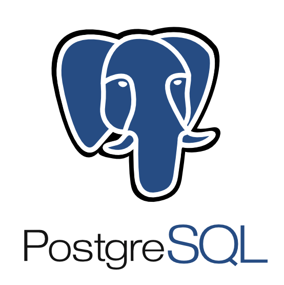

<!--
**DevJoaoPBB/DevJoaoPBB** is a ✨ _special_ ✨ repository because its `README.md` (this file) appears on your GitHub profile.

Here are some ideas to get you started:

- 🔭 I’m currently working on ...
- 🌱 I’m currently learning ...
- 👯 I’m looking to collaborate on ...
- 🤔 I’m looking for help with ...
- 💬 Ask me about ...
- 📫 How to reach me: ...
- 😄 Pronouns: ...
- ⚡ Fun fact: 
--><!DOCTYPE html>
<html lang="pt-br">
<head>
    <meta charset="UTF-8">
    <meta name="viewport" content="width=device-width, initial-scale=1.0">
</head>
<body>
    <header>

    </header>
    <section>
        <h2>Minhas Informações 📄</h2>
        <ul>
            <li><strong>Nome:</strong> João Pedro Bagnara Boeing</li>
            <li><strong>Profissão:</strong> Desenvolvedor Delphi - Interface Sistemas Inteligentes 🛠️</li>
            <li><strong>Formação:</strong> Cursando Sistemas de Informação IFPR - Campus Ivaiporã 🎓</li>
            <li><strong>Projetos:</strong> AgroBR e AlphaBR 🛠️</li>
        </ul>
    </section>
       
  
<!-- /-->

 
 
<h2> I.As Favoritas: </h2>

 
 

 

<h2> Linguagens de Programação: </h2>

 
 
 
 
 
<h2>Bancos de Dados:</h2>
 
  
  

 <h2>Frameworks / Ferramentas / Ide's:</h2> 
 

 

 

<h2> Outros Conhecimentos / Interesses: </h2>

 

      
<h2> 📩 Entre em Contado</h2>
  

  
  
    

 

</body>
</html>

